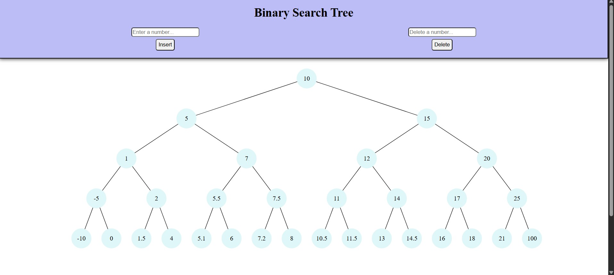

# Binary Tree Visualizer (React + Vite)

A simple and interactive binary tree visualizer built with React and SVG.
It renders a binary tree structure in the browser, automatically spacing and connecting nodes as you add and remove them.

React -> Component based rendering.

SVG -> Graphics for drawing nodes and edges.

JavaScript -> Layout calculations and tree traversal.

## Preview
Here's what the BST Visualizer looks like:

